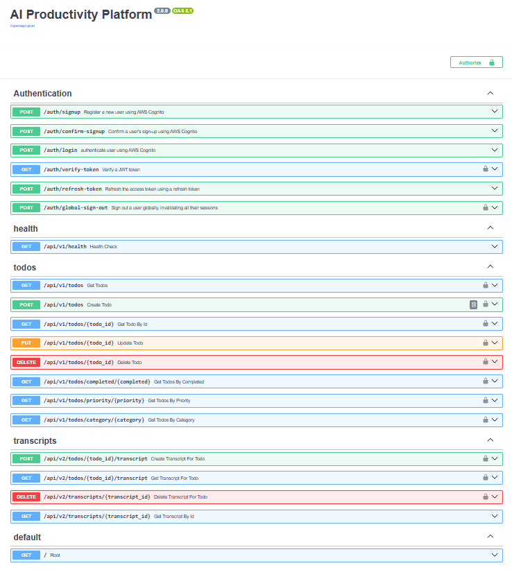

# AI PRODUCTIVITY PLATFORM

A production-inspired REST API for managing todo items, built with **FastAPI** and **Python**. Designed as a learning project to demonstrate professional backend architecture patterns applied to a simple, approachable domain.

---

## Version History

| Version | Storage Backend | Description |
|---|---|---|
| **v1.0** | JSON file | Local JSON file persistence. Simple, zero-setup storage. |
| **v1.1** | PostgreSQL on AWS RDS | Production-grade relational database. SQLAlchemy ORM, connection pooling, cloud-hosted on Amazon RDS. Alembic migrations for safe schema changes. Isolated SQLite test database. |
| **v1.2** | PostgreSQL + AWS Cognito | Added **authentication & authorization** via AWS Cognito + JWT. Multi-user support with user isolation. User registration, login, token refresh, global sign-out. Auto-creates user records on first login. |
| **v1.3** | PostgreSQL + AWS Cognito | Extended the Todo domain with **Priority** and **Category** support. Added enum-based validation, filtering endpoints, schema migration, repository/service updates, and expanded automated test coverage. |
| **v1.4** | PostgreSQL + AWS Cognito | Introduced the foundation for the AI Productivity Platform. Added Transcript domain models, database schema, repository layer, service layer, and API v2 architecture in preparation for transcript ingestion and RAG processing. |

> **Current version: v1.4 — AI Productivity Platform Foundation**

---

## Table of Contents

- [Overview](#overview)
- [Project Structure](#project-structure)
- [Architecture](#architecture)
- [API Endpoints](#api-endpoints)
- [Schemas](#schemas)
- [Getting Started](#getting-started)
- [Database Migrations](#database-migrations)
- [Running Tests](#running-tests)

---

## Overview

This project is evolving from a production-inspired Todo backend into an AI Productivity Platform.

Version 1.x focuses on building a production-grade backend foundation using FastAPI, PostgreSQL, AWS Cognito, SQLAlchemy, and layered architecture. Future versions extend this backend with transcript ingestion, cloud storage, Retrieval-Augmented Generation (RAG), semantic search, and AI-powered productivity features.

**Key features:**

- 🔐 **AWS Cognito authentication** — user sign-up, confirmation, login, token refresh, global sign-out
- 🔑 **JWT authorization** — every todo endpoint requires a valid access token
- 👤 **Multi-user isolation** — users can only see and modify their own todos
- 🏷️ **Priority & Category support** — enum-based fields with request validation
- 🔍 **Filtering endpoints** — retrieve todos by completion status, priority, or category
- 🗄️ **PostgreSQL + Alembic migrations** — production-grade database with version-controlled schema evolution
- 🧪 **Comprehensive test suite** — 60 automated tests covering API, authentication, service, repository, and storage layers
- 📝 **Request logging & middleware** — structured logs for every request

- 🚀 **AI Platform Foundation**

- API versioning (v1 and v2)
- Transcript module architecture
- Transcript metadata management
- Foundation for cloud file storage (Amazon S3)
- Foundation for Retrieval-Augmented Generation (RAG)


The codebase is intentionally structured to mirror real-world production patterns — layered concerns, dependency injection, custom exception handling, and isolated test environments.



**Tech Stack:**

| Tool | Purpose |
|---|---|
| FastAPI 0.138 | Web framework |
| Uvicorn 0.49 | ASGI server |
| Pydantic v2 | Data validation and serialization |
| pydantic-settings | Environment configuration |
| SQLAlchemy | ORM and database session management |
| psycopg2-binary | PostgreSQL driver |
| AWS RDS (PostgreSQL) | Cloud-hosted relational database |
| **AWS Cognito** | **User authentication & user pool management** |
| **boto3** | **AWS SDK for Python (Cognito integration)** |
| **PyJWT** | **JWT token decoding and verification** |
| **python-jose** | **JWT signature validation (JWKS)** |
| **requests** | **HTTP client for JWKS endpoint** |
| Alembic | Database migration tool |
| Pytest 9.1 | Testing framework |
| HTTPX | HTTP client for testing |

---

## Project Structure

```
app/
├── main.py                           # FastAPI app factory (no startup event — Alembic owns schema)
│
├── api/
│   ├── v1/
│   │   ├── router.py                 # Combines all v1 route groups
│   │   └── routes/
│   │       ├── health.py             # GET /api/v1/health
│   │       └── todos.py              # Todo CRUD + Filtering endpoints (requires auth)
│   └── v2/
│       ├── router.py
│       └── routes/
│           └── transcript.py         # Transcript Upload, Delete, Search (requires auth)
│
│
├── auth/
│   ├── cognito.py                    # AWS Cognito client (sign-up, login, token refresh, sign-out)
│   ├── jwt_verifier.py               # JWT verification (downloads JWKS, validates signatures)
│   ├── dependencies.py               # get_current_user, get_current_db_user
│   ├── exceptions.py                 # Auth-specific exceptions
│   ├── router.py                     # /auth endpoints (signup, confirm, login, refresh, sign-out)
│   ├── schemas.py                    # TokenClaims, LoginRequest/Response, etc.
│   └── service.py                    # Auth service layer
│
├── core/
│   ├── config.py                     # Settings loaded from .env (pydantic-settings)
│   ├── dependencies.py               # FastAPI dependency injection chain
│   ├── exception_handlers.py         # Maps custom exceptions to HTTP responses
│   ├── logging.py                    # Logging configuration
│   └── middleware.py                 # Request/response timing, logging, security headers
│
├── database/
│   ├── base.py                       # SQLAlchemy DeclarativeBase
│   ├── database.py                   # Engine, SessionLocal, get_db() dependency
│   └── models.py                     # TodoModel + UserModel + Transcript ORM definitions
│
├── schemas/
│   ├── todo.py                       # Todo Pydantic models (includes user_id)
│   ├── user.py                       # User Pydantic models (UserCreate, CurrentUserResponse)
│   └── transcript.py                 # transcript Pydantic model (TranscriptCreate, TranscriptResponse)
│
├── services/
│   ├── todo_service.py               # Todo business logic (now user-scoped)
│   ├── user_service.py               # User business logic (get_or_create on first login)
│   └── transcript_service.py         # transcript business logic (get_or_create for todo task)
│
├── repositories/
│   ├── postgres_todo_repository.py   # Todo CRUD with user_id filtering
│   ├── postgres_user_repository.py   # User CRUD via Cognito sub lookup
│   ├── json_todo_repository.py       # Legacy JSON CRUD (retained for reference)
│   └── transcript_repository.py      # transcript CRD with user_id & Todo_id filtering
│
├── storage/
│   └── json_storage.py               # Legacy JSON file I/O (retained for reference)
│
├── exceptions/
│   └── todo.py                       # TodoNotFoundError custom exception
│
├── tests/
│   ├── conftest.py                   # Pytest fixtures (SQLite in-memory, auth bypass)
│   ├── fakes.py                      # FakeTodoRepository, FakeCognitoClient, FakeJWTVerifier
│   ├── test_api.py                   # API integration tests (SQLite, isolated)
│   ├── test_auth.py                  # Auth endpoint tests (fake Cognito)
│   ├── test_service.py               # Service unit tests (in-memory fake)
│   ├── test_repository.py            # JSON repository unit tests
│   └── test_storage.py               # JSON storage tests
│
migrations/
├── env.py                            # Alembic environment (reads DATABASE_URL from .env)
├── script.py.mako                    # Migration file template
└── versions/
    ├── 20260703_0637_fabbfc95d6f4_initial_schema.py              # Baseline: todos table
    ├── 20260707_0325_d463e870d8f6_add_users_table_and_user_relationship.py  # Users + FK
    ├── 20260709_0503_7e1a7423a064_addition_of_priority_category_to_todo_.py  # Users (Priority + Category)
    └──20260710_0431_29027f8a809c_add_transcript_table.py                      # transcript table (FK todo_id)
alembic.ini                           # Alembic configuration
```

---

## Architecture

The app follows a **layered architecture** with **JWT-based authentication** — each layer has a single responsibility and communicates only with the layer directly below it.

```
HTTP Request + JWT Bearer Token
     │
     ▼
Auth Layer      — Verify JWT, lookup/create user in DB
     │
     ▼
  Routes        — Handle HTTP: parse input, return responses, inject current_user
     │
     ▼
  Services      — Business logic: enforce user ownership, generate IDs, set timestamps
     │
     ▼
  Repositories  — Data access: CRUD operations with user_id filtering via SQLAlchemy ORM
     │
     ▼
  Database      — PostgreSQL on AWS RDS (todos + users tables)
```

**Dependency injection** wires these layers together at runtime via FastAPI's `Depends()` system, defined in `core/dependencies.py` and `auth/dependencies.py`:

```
get_current_db_user  →  get_current_user  →  verify JWT  →  AWS Cognito JWKS
     │
     ├── get_user_service  →  get_user_repository  →  get_db  →  PostgreSQL
     │       │
     │       ▼
     │    get_service  →  get_postgres_repository  →  get_db  →  PostgreSQL
     │ 
     └── Todos
             │
             └── One-to-many
                     │
                     ▼
               Transcript Metadata
```

This makes each layer independently testable:
- **Integration tests** override `get_db` with an in-memory SQLite session and `get_current_db_user` with a fake user
- **Unit tests** swap repositories entirely for in-memory fakes (`FakeTodoRepository`, `FakeCognitoClient`)

---

## API Endpoints

Base URL prefix: `/api/v1`

### Authentication

All authentication endpoints are prefixed with `/auth` and **do not require a Bearer token** (they are used to obtain tokens).

| Method | Path | Description | Success Status |
|---|---|---|---|
| POST | `/auth/signup` | Register a new user | 200 |
| POST | `/auth/confirm-signup` | Confirm email with 6-digit code | 200 |
| POST | `/auth/login` | Authenticate and receive tokens | 200 |
| POST | `/auth/refresh-token` | Get new access token using refresh token | 200 |
| GET | `/auth/verify-token` | Verify a JWT token (for debugging) | 200 |
| POST | `/auth/global-sign-out` | Sign out globally (invalidate all sessions) | 200 |

**Sign-up request:**
```json
{
  "email": "user@example.com",
  "password": "SecurePass1!",
  "name": "John Doe"
}
```

**Login response:**
```json
{
  "access_token": "eyJraWQiOiI...",
  "id_token": "eyJraWQiOiI...",
  "refresh_token": "eyJjdHkiOiI...",
  "expires_in": 3600,
  "token_type": "Bearer"
}
```

> **Note:** After login, include the `access_token` in all `/api/v1/todos` requests via the `Authorization: Bearer <token>` header.

---

### Health

| Method | Path | Description | Status |
|---|---|---|---|
| GET | `/api/v1/health` | Liveness check | 200 |

**Response:**
```json
{ "status": "healthy" }
```

---

### Todos

**⚠️ All todo endpoints require authentication** — you must include a valid JWT access token in the `Authorization: Bearer <token>` header.

| Method | Path | Description | Success Status |
|---|---|---|---|
| GET | `/api/v1/todos` | List all todos **for the authenticated user** | 200 |
| POST | `/api/v1/todos` | Create a new todo | 201 |
| GET | `/api/v1/todos/{todo_id}` | Get a todo by UUID (user-scoped) | 200 |
| PUT | `/api/v1/todos/{todo_id}` | Update a todo (user-scoped) | 200 |
| DELETE | `/api/v1/todos/{todo_id}` | Delete a todo (user-scoped) | 204 |
| GET | `/api/v1/todos/completed/{completed}` | Filter todos by completion status | 200 |
| GET | `/api/v1/todos/priority/{priority}` | Filter todos by priority | 200 |
| GET | `/api/v1/todos/category/{category}` | Filter todos by category | 200 |
| POST | `/api/v2/todos/{todo_id}/transcript` | Upload a new transcript for todo | 201 |
| GET | `/api/v2/todos/{todo_id}/transcript` | Get a transcript by todo if uploaded | 200 |
| DELETE | `/api/v2/transcripts/{transcript_id}` | Delete transcript by transcript id | 204 |
| GET | `/api/v2/transcripts/{transcript_id}` | Get transcript by transcript id | 200 |

#### Error Responses

| Scenario | Status | Body |
|---|---|---|
| Missing or invalid token | 401 | `{"detail": "Invalid or expired token."}` |
| Todo not found (or belongs to another user) | 404 | `{"detail": "Todo with id '...' was not found."}` |
| Invalid UUID format | 422 | Pydantic validation error |
| Invalid request body | 422 | Pydantic validation error |

---

## Schemas

### `TodoCreate` (POST request body)

| Field | Type | Rules |
|---|---|---|
| `title` | `string` | Required, 3–100 characters |
| `description` | `string \| null` | Optional, max 500 characters |
| `priority` | `Priority` | Required. One of: `low`, `medium`, `high` |
| `category` | `Category` | Required. One of: `work`, `personal` |

### `TodoUpdate` (PUT request body)

All fields are optional — send only the fields you want to change.

| Field | Type |
|---|---|
| `title` | `string \| null` |
| `description` | `string \| null` |
| `completed` | `boolean \| null` |
| `priority` | `Priority \| null` |
| `category` | `Category \| null` |

### `TodoResponse`

| Field | Type |
|---|---|
| `id` | `UUID` |
| `title` | `string` |
| `description` | `string \| null` |
| `completed` | `boolean` |
| `user_id` | `string \| null` |
| `priority` | `Priority` |
| `category` | `Category` |
| `created_at` | `datetime (UTC)` |
| `updated_at` | `datetime (UTC)` |

### `TodoListResponse`

| Field | Type |
|---|---|
| `total` | `integer` |
| `items` | `TodoResponse[]` |

---

## Getting Started

### Prerequisites

- Python 3.11+
- A PostgreSQL database (local or cloud — e.g. AWS RDS)

### Installation

```bash
# Clone the repository
git clone <repo-url>
cd Fast_api

# Create and activate a virtual environment
python -m venv .venv
.venv\Scripts\Activate.ps1   # Windows PowerShell
# source .venv/bin/activate   # macOS/Linux

# Install dependencies
pip install -r requirements.txt
```

### Configuration

Create a `.env` file in the project root:

```env
APP_NAME=ToDo API
APP_VERSION=1.2.0
DEBUG=True
DATA_FILE=app/data/todo.json
DATABASE_URL=postgresql+psycopg2://<user>:<password>@<host>:<port>/<database>

# AWS Cognito settings
AWS_REGION=us-east-1
COGNITO_USER_POOL_ID=us-east-1_XXXXXXXXX
COGNITO_CLIENT_ID=xxxxxxxxxxxxxxxxxxxxxxxxxx
COGNITO_CLIENT_SECRET=xxxxxxxxxxxxxxxxxxxxxxxxxxxxxxxxxxxxxxxxxxxxxxxxxx
```

| Variable | Description |
|---|---|
| `APP_NAME` | Name shown in API metadata |
| `APP_VERSION` | Version shown in API metadata |
| `DEBUG` | Enables debug mode |
| `DATA_FILE` | Path to legacy JSON file (unused in v1.2, kept for reference) |
| `DATABASE_URL` | Full SQLAlchemy connection string to your PostgreSQL database |
| `AWS_REGION` | AWS region where your Cognito User Pool is hosted |
| `COGNITO_USER_POOL_ID` | Your Cognito User Pool ID |
| `COGNITO_CLIENT_ID` | Your Cognito App Client ID |
| `COGNITO_CLIENT_SECRET` | Your Cognito App Client Secret |

> **First-time setup:** run `alembic upgrade head` after configuring `.env` to create all tables (including `users` and `todos`) via the migration history. See the [Database Migrations](#database-migrations) section below.

### Running the Server

```bash
uvicorn app.main:app --reload
```

The API will be available at `http://localhost:8000`.

Interactive docs are served automatically at:
- **Swagger UI:** `http://localhost:8000/docs`
- **ReDoc:** `http://localhost:8000/redoc`

---

## Database Migrations

Schema changes are managed with **Alembic**. Every change to a model column is captured in a versioned migration file and applied to the database in a controlled, reversible way.

### Current migration history

| Revision | Description |
|---|---|
| `fabbfc95d6f4` | `initial_schema` — baseline for the `todos` table |
| `d463e870d8f6` | `add_users_table_and_user_relationship` — adds `users` table and `user_id` FK to `todos` |
| `7e1a7423a064` | `addition_of_priority_category_to_todo` — adds enum-based `priority` and `category` columns to the `todos` table|
| `29027f8a809c` | `add_transcript_table` - adds `transcripts` table with FK from `todos` |

> **Note:** The `user_id` column in the `todos` table is nullable to preserve existing todos created before multi-user support was added. New todos always have a `user_id` enforced by the application layer.

### Common commands

```bash
# Apply all pending migrations (use on a fresh database or after pulling new migrations)
alembic upgrade head

# Check which revision the database is currently at
alembic current

# Show the full migration history
alembic history --verbose

# Roll back the last applied migration
alembic downgrade -1
```

### Adding a new column (example workflow)

**Step 1 — Update the model** in `app/database/models.py`:
```python
priority: Mapped[int] = mapped_column(Integer, default=0)
```

**Step 2 — Generate the migration** (Alembic diffs the model against the live DB):
```bash
alembic revision --autogenerate -m "add_priority_to_todos"
```

**Step 3 — Review** the generated file in `migrations/versions/` and confirm the SQL is correct.

**Step 4 — Apply it:**
```bash
alembic upgrade head
```

> `alembic.ini` does **not** contain the database URL. Alembic reads `DATABASE_URL` directly from `.env` at runtime, so credentials are never stored in a config file.

---

## Running Tests

```bash
pytest
```

The project currently contains **60 automated tests** covering API, authentication, business logic, repositories, and storage.

| File | Layer | Approach | Database |
|---|---|---|---|
| `test_api.py` | API (integration) | CRUD, filtering endpoints, validation | SQLite in-memory |
| `test_auth.py` | Authentication | Fake Cognito authentication flow | None |
| `test_service.py` | Service | In-memory fake repositories | None |
| `test_repository.py` | Repository | CRUD + filtering operations | None |
| `test_storage.py` | Storage | Storage fixture validation | None |

> Integration tests use a shared **in-memory SQLite database** built from the same SQLAlchemy models as production. The schema is identical, the production PostgreSQL database is never opened, and all rows are cleared between tests. This also makes the test suite run significantly faster (~24 s vs ~65 s over the network).

Run with verbose output:

```bash
pytest -v
```

## License

See [LICENSE](LICENSE).

